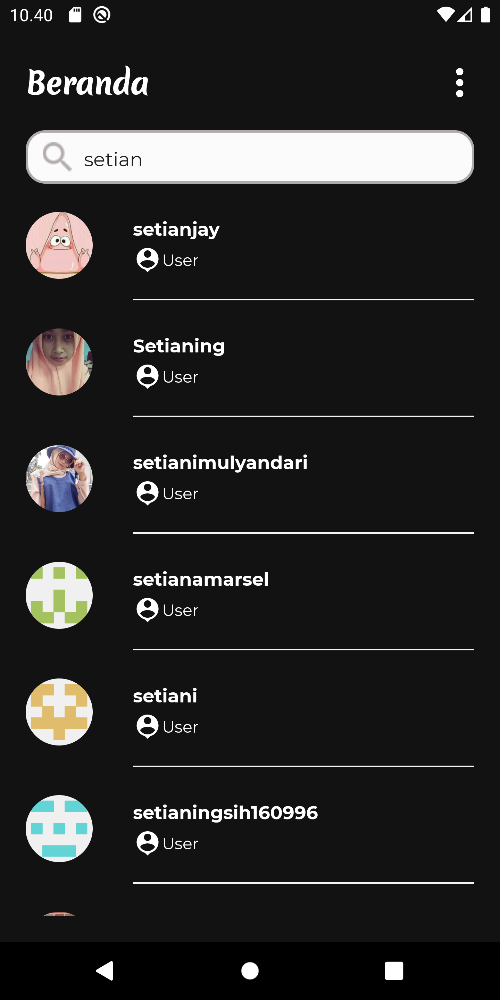
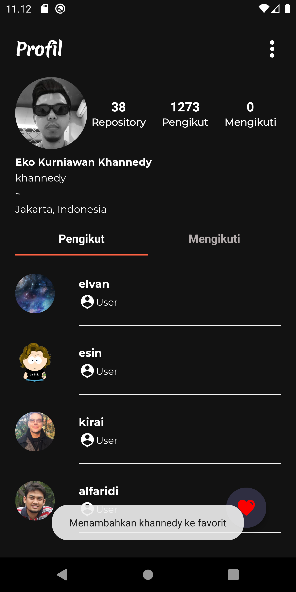

# GithubUser

  

GithubUser is the result of my submission in [**Dicoding**](https://www.dicoding.com/) class that is[**"Belajar Fundamental Aplikasi Android (BFAA)"**](https://www.dicoding.com/academies/14), you can find your friends or co-workers who are on Github, you can also see the profile and also add to your list of favorite users. 

This app is built :
1. Using MVVM (Model-View-ViewModel) Architecture
2. Using Single activity and using navigation component to manage fragment operations
3. Using localization for support Indonesian and English Language
4. Using Room Persistence for local database
5. Using ViewBinding
6. Using Coroutine to handle data flow
7. Using Retrofit to request api network
8. Using Glide for load and caching image from url
9. There is an explanatory comment on each function, making it easier to understand the flow of the application

## Note
> This repository consists of 3 submissions :  
> - Submission 1 (**5 stars**) : Get data from local (hardcode).  
> - Submission 2 (**5 stars**) : Get data from Github API &amp; Localization (multi language).  
> - Submission 3 (**5 stars**) : Local database &amp; Dark mode.

*Hopefully this repository can be useful as a reference.*

## Demo
### Search Screen
<h4 align="center">Light Mode</h4>

    
    
    

<h4 align="center">Dark Mode</h4>

    
    
    

### Profile Screen
<h4 align="center">Light Mode</h4>

    
    
    
    

<h4 align="center">Dark Mode</h4>

    
    
    
    

### Favorite Screen
<h4 align="center">Light Mode</h4>

    
    

<h4 align="center">Dark Mode</h4>

    
    

### Settings Screen
<h4 align="center">Light Mode</h4>

    

<h4 align="center">Dark Mode</h4>

    

## Features
- Search your friends or co-workers on [Github](https://github.com/)
- Can add / delete your friends or co-workers to favorite
- Multi language (English or Bahasa)
- Change theme (Light Mode / Dark Mode)

## Dependencies
- [AndroidX](https://androidx.tech/)
- [CircleImage](https://github.com/hdodenhof/CircleImageView)
- [Coroutine](https://github.com/Kotlin/kotlinx.coroutines)
- [DataStore](https://androidx.tech/artifacts/datastore/datastore-preferences/)
- [Glide](https://github.com/bumptech/glide)
- [OkHttp](https://github.com/square/okhttp)
- [Retorfit](https://square.github.io/retrofit/)
- [Timber](https://github.com/JakeWharton/timber)

## Support Me
Just **Give Star** for this repository or **Follow** my Github, you have **Supported Me**.    

## Author
Hari Setiaji - [setianjay](https://github.com/setianjay) on Github, [Hari Setiaji](https://www.linkedin.com/in/hari-setiaji-3412ba189/) on Linkedin.